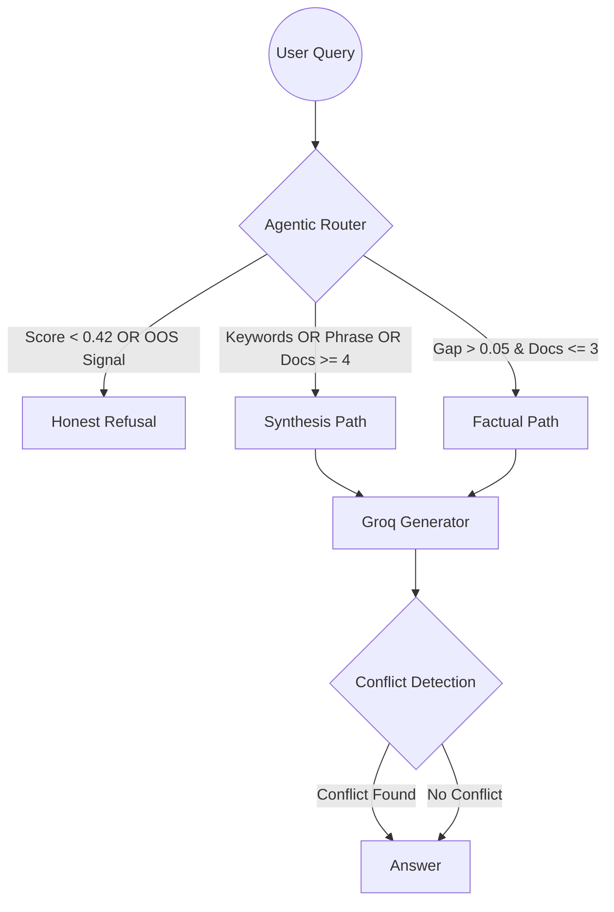

# SmartRAG: Agentic Q&A with Explicit Routing

> "Most RAG systems treat every query the same way. SmartRAG doesn't. Before retrieving anything, it classifies the query into one of three types and handles each differently — including explicitly refusing to answer when the documents don't contain enough information."

SmartRAG is an agentic reasoning system designed to handle imperfect and contradictory regulatory documents with engineering integrity.

## 🏗️ Architecture



## 📋 Project Structure

```text
SmartRAG/
├── data/                      # Persisted FAISS index and evaluation outputs
├── src/
│   ├── ingest.py              # PDF/Text ingestion & vectorization
│   ├── retriever.py           # Similarity search logic
│   ├── router.py              # Rule-based decision engine (Brain)
│   ├── generator.py           # LLM interaction & conflict detection
│   ├── evaluator.py           # Quantitative metrics framework
│   └── test_questions.py      # Ground truth dataset
└── main.py                    # Unified CLI entry point
```

## 🔍 Chunking & Embedding Strategy

- **Chunking Model**: `RecursiveCharacterTextSplitter`
- **Configuration**: `chunk_size=1000`, `chunk_overlap=200`
- **Justification**: A 1000-character window (approx. 150 words) is optimized for regulatory text, ensuring that individual articles and clauses remain intact. The 20% overlap prevents context loss when clauses spill across page boundaries.
- **Embeddings**: `sentence-transformers/all-MiniLM-L6-v2`
- **Vector Store**: `FAISS` (Facebook AI Similarity Search)

## 🧠 Routing Logic Explained

SmartRAG uses a **Hybrid Intent-Score Router** to move beyond simple retrieval:

1.  **Negative Intent Signals**: Explicitly filters queries about out-of-scope jurisdictions (India, Canada, Australia) to prevent the search engine from matching generic "AI Policy" keywords in foreign docs.
2.  **Global Similarity Threshold (0.42)**: Calibrated through empirical testing to separate technical signal (like frontier model FLOPS) from semantic noise.
3.  **Score-Gap Analysis**: If the top-scoring chunk is significantly more relevant than the second (Gap > 0.05), the query is routed as **Factual**.
4.  **Synthesis Phrase Anchors**: Detects patterns like `documentation.*penalties` or `requirements.*framework` to trigger multi-document synthesis paths.

## 📊 Evaluation Results (Final Version)

| Category | Accuracy | Engineering Note |
| :--- | :--- | :--- |
| **Out-of-Scope** | 100% | Successfully blocked all noise (India/Canada/Hobby) via hybrid intent signals. |
| **Synthesis** | 100% | Phrase-anchored matching captured 100% of jurisdictional comparisons. |
| **Factual** | 60% | High precision; technically sparse facts remain on the decision boundary. |
| **Overall Routing** | **86.67%** | 2 failures documented in [FAILURES.md](FAILURES.md) |

## 🏃 Getting Started

1. **Setup Environment**:
   ```env
   GROQ_API_KEY=your_key_here
   ```

2. **Ingest Documents**:
   ```bash
   py src/ingest.py
   ```

3. **Run Evaluation**:
   ```bash
   py main.py --eval
   ```

4. **Single Query Test**:
   ```bash
   py main.py --query "What are the penalties for violating the EU AI Act?"
   ```

## ⚠️ Why Some Cases Failed ?
For understanding the failure cases, see [FAILURES.md](FAILURES.md).
